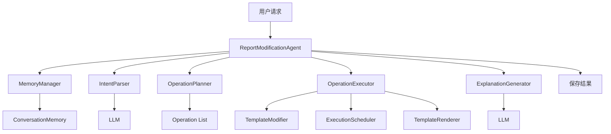
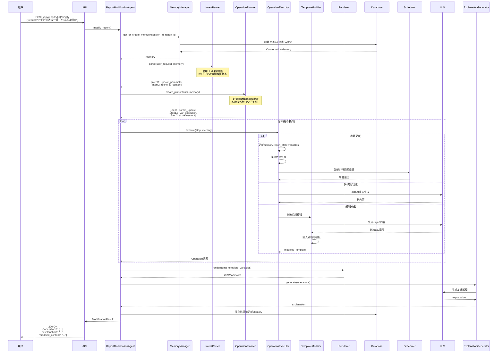

# 报告修改Agent化最终方案

## 一、整体架构

### 1.1 系统分层

```
┌─────────────────────────────────────────────────────────┐
│            用户交互层 (User Interface Layer)              │
│  - REST API: /api/reports/{id}/modify                   │
│  - WebSocket: 实时进度推送                               │
└─────────────────────────────────────────────────────────┘
                          ↓
┌─────────────────────────────────────────────────────────┐
│          Agent协调层 (Agent Orchestration Layer)         │
│  ┌────────────────────────────────────────────────┐    │
│  │   ReportModificationAgent                      │    │
│  │   - 意图解析 (IntentParser)                    │    │
│  │   - 操作规划 (OperationPlanner)               │    │
│  │   - 操作执行 (OperationExecutor)              │    │
│  │   - 结果解释 (ExplanationGenerator)           │    │
│  │   - Memory管理 (MemoryManager)                │    │
│  └────────────────────────────────────────────────┘    │
└─────────────────────────────────────────────────────────┘
                          ↓
┌─────────────────────────────────────────────────────────┐
│            业务逻辑层 (Service Layer) 【复用】            │
│  ┌──────────────┐  ┌──────────────┐  ┌──────────────┐ │
│  │ Execution    │  │  Template    │  │  Variable    │ │
│  │ Scheduler    │  │  Renderer    │  │  Executors   │ │
│  └──────────────┘  └──────────────┘  └──────────────┘ │
└─────────────────────────────────────────────────────────┘
                          ↓
┌─────────────────────────────────────────────────────────┐
│              数据层 (Data Layer) 【复用+扩展】            │
│  ┌──────────────┐  ┌──────────────┐  ┌──────────────┐ │
│  │  Database    │  │   External   │  │      AI      │ │
│  │  + Memory    │  │   APIs       │  │   (LangChain)│ │
│  └──────────────┘  └──────────────┘  └──────────────┘ │
└─────────────────────────────────────────────────────────┘
```

### 1.2 核心组件关系



---

## 二、核心数据结构

### 2.1 修改结果（统一返回体）

```python
from typing import List, Dict, Any, Optional, Union, Literal
from pydantic import BaseModel, Field
from datetime import datetime

class ModificationResult(BaseModel):
    """修改结果：支持多个操作"""
    
    success: bool
    report_id: str
    
    # === 操作列表（支持层级） ===
    operations: List['Operation']
    
    # === 整体解释（汇总所有操作） ===
    explanation: str
    
    # === 最终的报告内容 ===
    modified_content: Optional[str] = None
    
    # === 整体元数据 ===
    metadata: ModificationMetadata


class Operation(BaseModel):
    """单个操作（支持层级）"""
    
    # 操作ID
    id: str  # "op_1", "op_1_1", "op_1_2"
    
    # 操作类型
    type: Literal[
        "parameter_update",
        "variable_execution", 
        "ai_refinement",
        "template_modification",
        "content_insertion"
    ]
    
    # 操作状态
    status: Literal["success", "failed", "skipped", "partial"]
    
    # 描述
    description: str
    
    # 层级支持
    parent_id: Optional[str] = None
    children: List['Operation'] = []
    
    # 类型特定的详情
    details: Union[
        ParameterUpdateDetails,
        VariableExecutionDetails,
        AIRefinementDetails,
        TemplateModificationDetails,
        ContentInsertionDetails
    ] = Field(..., discriminator='type')
    
    # 执行时间
    execution_time_ms: int
    
    # 错误信息
    error: Optional[str] = None


class ModificationMetadata(BaseModel):
    """整体元数据"""
    timestamp: str
    total_duration_ms: int
    total_operations: int
    successful_operations: int
    failed_operations: int
    total_cost_usd: float


# 启用前向引用
Operation.model_rebuild()
```

### 2.2 操作详情（多态）

```python
# ============ 1. 参数更新详情 ============
class ParameterUpdateDetails(BaseModel):
    type: Literal["parameter_update"] = "parameter_update"
    parameters: List[ParameterChange]


class ParameterChange(BaseModel):
    name: str
    old_value: Any
    new_value: Any


# ============ 2. 变量执行详情 ============
class VariableExecutionDetails(BaseModel):
    type: Literal["variable_execution"] = "variable_execution"
    variables: List[ExecutedVariable]


class ExecutedVariable(BaseModel):
    name: str
    source_type: str  # "sql" | "api" | "ai_generation"
    status: Literal["success", "failed", "cached", "skipped"]
    execution_time_ms: int
    
    # 变化摘要（规则优先，AI为辅）
    change_summary: Optional[str] = None
    error: Optional[str] = None


# ============ 3. AI优化详情 ============
class AIRefinementDetails(BaseModel):
    type: Literal["ai_refinement"] = "ai_refinement"
    
    variable_name: str
    refinement_instruction: str
    
    before_length: int
    after_length: int
    
    model: str
    tokens_used: int
    cost_usd: float


# ============ 4. 模板修改详情 ============
class TemplateModificationDetails(BaseModel):
    type: Literal["template_modification"] = "template_modification"
    
    modification_type: Literal["add_section", "modify_section", "remove_section"]
    section_title: str
    
    # 新增的变量（如果有）
    added_variables: List[AddedVariable]
    
    # 是否保存为新模板版本
    saved_as_template: bool = False
    new_template_id: Optional[str] = None


class AddedVariable(BaseModel):
    name: str
    type: str  # "template" | "runtime"
    source_type: str  # "sql" | "api" | "ai_generation"
    description: str


# ============ 5. 内容插入详情 ============
class ContentInsertionDetails(BaseModel):
    type: Literal["content_insertion"] = "content_insertion"
    
    position_description: str  # "在问题分析后面"
    content_preview: str  # 前200字符
    variables_used: List[str]
```

### 2.3 报告状态（Memory核心）

```python
class ReportState(BaseModel):
    """报告的完整状态"""
    
    # === 统一的变量管理 ===
    variables: Dict[str, VariableInfo]
    
    # === 用户输入（快速访问） ===
    user_inputs: Dict[str, Any]
    
    # === 报告结构 ===
    report_structure: ReportStructure
    
    # === 临时模板（如果有修改） ===
    temp_template_content: Optional[str] = None
    original_template_content: str
    
    # === 版本信息 ===
    version: int
    generated_at: str


class VariableInfo(BaseModel):
    """统一的变量信息"""
    
    name: str
    value: Any
    type: Literal["template", "runtime"]
    
    # === 模板变量特有 ===
    source: Optional[str] = None
    metadata: Optional[dict] = None
    
    # === 运行时变量特有 ===
    generation_context: Optional[GenerationContext] = None
    created_in_turn: Optional[int] = None
    
    # === 通用 ===
    last_modified: str
    is_dirty: bool = False


class GenerationContext(BaseModel):
    """生成上下文（用于重新生成）"""
    prompt_template: Optional[str] = None
    data_sources: List[str]
    generation_params: Dict[str, Any] = {}
    jinja2_template: Optional[str] = None  # 如果是从模板生成的


class ReportStructure(BaseModel):
    """报告结构信息"""
    sections: List[Section]
    total_length: int
    total_sections: int
    max_level: int
    
    # 内容统计
    content_stats: Optional[ContentStats] = None


class Section(BaseModel):
    level: int  # 1-6
    title: str
    start_line: int
    end_line: int
    content_preview: str
    variables_used: List[str]  # 该章节使用的变量


class ContentStats(BaseModel):
    """内容统计"""
    has_tables: bool
    table_count: int
    has_images: bool
    image_count: int
    has_code_blocks: bool
    code_block_count: int
```

### 2.4 对话记忆（Memory）

```python
class ConversationMemory(BaseModel):
    """对话记忆"""
    
    session_id: str
    report_id: str
    started_at: str
    
    # === 核心：报告状态 ===
    report_state: ReportState
    
    # === 对话历史 ===
    conversation_history: List[ConversationTurn]
    
    # === 上下文摘要（超过10轮后生成） ===
    context_summary: Optional[str] = None


class ConversationTurn(BaseModel):
    """单轮对话"""
    turn_id: int
    timestamp: str
    
    user_message: str
    assistant_response: str
    
    operations_performed: List[str]  # operation IDs
    state_changes: Dict[str, Any]  # 变量变化
```

---

## 三、核心组件实现

### 3.1 ReportModificationAgent（主控制器）

```python
class ReportModificationAgent:
    """报告修改Agent主控制器"""
    
    def __init__(
        self,
        scheduler: ExecutionScheduler,
        renderer: TemplateRenderer,
        llm: BaseChatModel,
        db_session: AsyncSession
    ):
        self.scheduler = scheduler
        self.renderer = renderer
        self.llm = llm
        self.session = db_session
        
        # 子组件
        self.intent_parser = IntentParser(llm)
        self.memory_manager = MemoryManager(llm, db_session)
        self.operation_planner = OperationPlanner()
        self.operation_executor = OperationExecutor(scheduler, renderer, llm)
        self.explanation_generator = ExplanationGenerator(llm)
    
    async def modify_report(
        self,
        user_request: str,
        report_id: str,
        session_id: Optional[str] = None
    ) -> ModificationResult:
        """
        主入口：处理报告修改请求
        """
        start_time = datetime.now()
        
        # 1. 获取或创建对话记忆
        memory = await self.memory_manager.get_or_create_memory(
            session_id=session_id or f"sess_{report_id}_{int(time.time())}",
            report_id=report_id
        )
        
        # 2. 解析意图
        intents = await self.intent_parser.parse(
            user_request=user_request,
            memory=memory
        )
        
        # 3. 生成操作计划
        operation_plan = await self.operation_planner.create_plan(
            intents=intents,
            memory=memory
        )
        
        # 4. 执行操作链
        operations = []
        for step in operation_plan:
            try:
                operation = await self.operation_executor.execute(
                    step=step,
                    memory=memory
                )
                operations.append(operation)
            except Exception as e:
                # 记录失败操作
                operations.append(Operation(
                    id=step.id,
                    type=step.type,
                    status="failed",
                    description=step.description,
                    execution_time_ms=0,
                    error=str(e),
                    details=self._create_empty_details(step.type)
                ))
        
        # 5. 生成最终报告内容
        new_content = await self._render_final_report(memory)
        
        # 6. 生成解释
        explanation = await self.explanation_generator.generate(
            user_request=user_request,
            operations=operations
        )
        
        # 7. 保存结果
        await self._save_results(
            report_id=report_id,
            new_content=new_content,
            memory=memory
        )
        
        # 8. 更新Memory
        await self.memory_manager.update_memory(
            memory=memory,
            user_message=user_request,
            assistant_response=explanation,
            operations=operations
        )
        
        # 9. 构建返回结果
        duration_ms = int((datetime.now() - start_time).total_seconds() * 1000)
        
        return ModificationResult(
            success=all(op.status in ["success", "skipped"] for op in operations),
            report_id=report_id,
            operations=operations,
            explanation=explanation,
            modified_content=new_content,
            metadata=ModificationMetadata(
                timestamp=datetime.now().isoformat(),
                total_duration_ms=duration_ms,
                total_operations=len(operations),
                successful_operations=sum(1 for op in operations if op.status == "success"),
                failed_operations=sum(1 for op in operations if op.status == "failed"),
                total_cost_usd=sum(
                    op.details.cost_usd 
                    for op in operations 
                    if hasattr(op.details, 'cost_usd')
                )
            )
        )
    
    async def _render_final_report(
        self, 
        memory: ConversationMemory
    ) -> str:
        """渲染最终报告"""
        # 使用当前的临时模板（如果有）
        # 或使用原始模板
        template_content = memory.report_state.temp_template_content or \
                          memory.report_state.original_template_content
        
        # 准备变量
        template_vars = {
            name: info.value
            for name, info in memory.report_state.variables.items()
            if info.type == "template"
        }
        
        # 渲染
        return await self.renderer.render(
            template_content=template_content,
            variables=template_vars
        )
```

### 3.2 IntentParser（意图解析器）

```python
class IntentParser:
    """意图解析器（支持多意图+Memory）"""
    
    def __init__(self, llm: BaseChatModel):
        self.llm = llm
        self.parser = JsonOutputParser(pydantic_object=MultiIntentResponse)
    
    async def parse(
        self,
        user_request: str,
        memory: ConversationMemory
    ) -> List[ModificationIntent]:
        """解析用户意图"""
        
        # 构建上下文
        context = self._build_context(memory)
        
        prompt = ChatPromptTemplate.from_messages([
            ("system", self._get_system_prompt()),
            ("user", self._get_user_prompt())
        ])
        
        chain = prompt | self.llm | self.parser
        
        result = await chain.ainvoke({
            "user_request": user_request,
            **context
        })
        
        return result["intents"]
    
    def _build_context(self, memory: ConversationMemory) -> dict:
        """构建完整上下文"""
        state = memory.report_state
        
        return {
            # 当前输入参数
            "current_inputs": json.dumps(
                state.user_inputs, 
                ensure_ascii=False, 
                indent=2
            ),
            
            # 报告结构
            "report_sections": "\n".join([
                f"- {s.title} (第{s.level}级标题, 行{s.start_line}-{s.end_line})"
                for s in state.report_structure.sections
            ]),
            
            # 可用变量
            "available_variables": self._format_variables(state.variables),
            
            # 近期对话（最近3轮）
            "recent_conversation": self._format_conversation(
                memory.conversation_history[-3:]
            ),
            
            # 上下文摘要
            "context_summary": memory.context_summary or "（首次对话）"
        }
    
    def _format_variables(self, variables: Dict[str, VariableInfo]) -> str:
        """格式化变量列表"""
        lines = []
        for name, info in variables.items():
            prefix = "📋" if info.type == "template" else "✨"
            desc = info.metadata.get('description', '') if info.metadata else ''
            lines.append(f"{prefix} {name} ({info.type}): {desc}")
        return "\n".join(lines)
    
    def _get_system_prompt(self) -> str:
        return """你是一个报告修改意图分析专家。

你需要理解用户的修改请求，并结合以下上下文：
1. **当前报告的输入参数**：了解报告是基于什么数据生成的
2. **报告的章节结构**：知道报告有哪些部分
3. **可用的变量**：
   - 📋 模板变量：在模板中定义的变量（如SQL查询、API调用）
   - ✨ 运行时变量：对话中动态创建的变量（如新增的章节）
4. **近期对话历史**：理解上下文和指代

特别注意：
- **相对值修改**：用户说"再延长一周"，需要基于当前值计算
- **指代消解**：用户说"把它改成..."，需要从历史找出"它"指什么
- **增量操作**：用户说"再加上XX"，需要知道现有内容

输出要求：
- 一个请求可能包含多个子意图
- 每个意图独立描述
- 输出JSON数组格式

支持的意图类型：
1. **update_parameter**: 修改输入参数
2. **refine_ai_content**: 优化AI生成的内容
3. **add_section**: 增加新的章节/分析
4. **modify_section**: 修改已有章节
"""
    
    def _get_user_prompt(self) -> str:
        return """# 用户请求
{user_request}

# 当前报告状态
## 输入参数
{current_inputs}

## 报告章节
{report_sections}

## 可用变量
{available_variables}

# 近期对话
{recent_conversation}

# 上下文摘要
{context_summary}

---

请分析用户意图，输出JSON格式：
{{
  "intents": [
    {{
      "type": "update_parameter",
      "description": "...",
      "target_variable": "...",
      "new_value": "..."
    }},
    ...
  ]
}}
"""


class MultiIntentResponse(BaseModel):
    """多意图响应"""
    intents: List[ModificationIntent]


class ModificationIntent(BaseModel):
    """修改意图"""
    type: Literal[
        "update_parameter",
        "refine_ai_content", 
        "add_section",
        "modify_section"
    ]
    description: str
    
    # update_parameter
    target_variable: Optional[str] = None
    new_value: Optional[Any] = None
    
    # refine_ai_content
    ai_variable: Optional[str] = None
    refinement_instruction: Optional[str] = None
    
    # add_section / modify_section
    section_title: Optional[str] = None
    section_description: Optional[str] = None
    position_description: Optional[str] = None
```

### 3.3 OperationPlanner（操作规划器）

```python
class OperationPlanner:
    """操作规划器：将意图转换为操作计划"""
    
    async def create_plan(
        self,
        intents: List[ModificationIntent],
        memory: ConversationMemory
    ) -> List[OperationStep]:
        """创建操作计划"""
        
        plan = []
        op_counter = 1
        
        for intent in intents:
            if intent.type == "update_parameter":
                # 参数更新 + 依赖变量重新执行
                steps = self._plan_parameter_update(
                    intent, memory, op_counter
                )
                plan.extend(steps)
                op_counter += len(steps)
            
            elif intent.type == "refine_ai_content":
                # AI内容优化
                step = self._plan_ai_refinement(
                    intent, memory, op_counter
                )
                plan.append(step)
                op_counter += 1
            
            elif intent.type == "add_section":
                # 新增章节
                steps = self._plan_section_addition(
                    intent, memory, op_counter
                )
                plan.extend(steps)
                op_counter += len(steps)
            
            elif intent.type == "modify_section":
                # 修改章节
                step = self._plan_section_modification(
                    intent, memory, op_counter
                )
                plan.append(step)
                op_counter += 1
        
        return plan
    
    def _plan_parameter_update(
        self,
        intent: ModificationIntent,
        memory: ConversationMemory,
        start_id: int
    ) -> List[OperationStep]:
        """规划参数更新操作"""
        steps = []
        
        # 步骤1: 更新参数
        steps.append(OperationStep(
            id=f"op_{start_id}",
            type="parameter_update",
            description=f"更新参数 {intent.target_variable}",
            intent=intent,
            parent_id=None
        ))
        
        # 步骤2: 找出依赖变量
        affected_vars = self._find_dependent_variables(
            intent.target_variable,
            memory.report_state
        )
        
        if affected_vars:
            steps.append(OperationStep(
                id=f"op_{start_id}_1",
                type="variable_execution",
                description=f"重新执行 {len(affected_vars)} 个依赖变量",
                intent=intent,
                parent_id=f"op_{start_id}",
                metadata={"variables": affected_vars}
            ))
        
        return steps
    
    def _find_dependent_variables(
        self,
        changed_variable: str,
        state: ReportState
    ) -> List[str]:
        """查找依赖变量"""
        # 简化实现：检查metadata中的dependencies
        dependent = []
        for var_name, var_info in state.variables.items():
            if var_info.type == "template" and var_info.metadata:
                deps = var_info.metadata.get("dependencies", [])
                if changed_variable in deps:
                    dependent.append(var_name)
        return dependent


class OperationStep(BaseModel):
    """操作步骤（内部使用）"""
    id: str
    type: str
    description: str
    intent: ModificationIntent
    parent_id: Optional[str] = None
    metadata: Dict[str, Any] = {}
```

### 3.4 OperationExecutor（操作执行器）

```python
class OperationExecutor:
    """操作执行器"""
    
    def __init__(
        self,
        scheduler: ExecutionScheduler,
        renderer: TemplateRenderer,
        llm: BaseChatModel
    ):
        self.scheduler = scheduler
        self.renderer = renderer
        self.llm = llm
        
        # 具体策略
        self.param_updater = ParameterUpdateStrategy(scheduler, renderer)
        self.ai_refiner = AIRefinementStrategy(llm)
        self.template_modifier = TemplateModificationStrategy(llm, scheduler)
    
    async def execute(
        self,
        step: OperationStep,
        memory: ConversationMemory
    ) -> Operation:
        """执行单个操作步骤"""
        
        start_time = datetime.now()
        
        try:
            if step.type == "parameter_update":
                result = await self.param_updater.execute(step, memory)
            
            elif step.type == "variable_execution":
                result = await self._execute_variables(step, memory)
            
            elif step.type == "ai_refinement":
                result = await self.ai_refiner.execute(step, memory)
            
            elif step.type == "template_modification":
                result = await self.template_modifier.execute(step, memory)
            
            else:
                raise ValueError(f"Unknown operation type: {step.type}")
            
            duration = int((datetime.now() - start_time).total_seconds() * 1000)
            
            return Operation(
                id=step.id,
                type=step.type,
                status="success",
                description=step.description,
                parent_id=step.parent_id,
                details=result.details,
                execution_time_ms=duration
            )
        
        except Exception as e:
            duration = int((datetime.now() - start_time).total_seconds() * 1000)
            
            return Operation(
                id=step.id,
                type=step.type,
                status="failed",
                description=step.description,
                parent_id=step.parent_id,
                details=self._create_error_details(step.type),
                execution_time_ms=duration,
                error=str(e)
            )
```

### 3.5 TemplateModificationStrategy（模板修改策略）

```python
class TemplateModificationStrategy:
    """模板修改策略：使用临时模板渲染方案"""
    
    async def execute(
        self,
        step: OperationStep,
        memory: ConversationMemory
    ) -> StrategyResult:
        """
        执行模板修改
        
        核心思路：
        1. 不修改原始模板
        2. 创建临时模板
        3. 在临时模板中插入Jinja2内容
        4. 重新渲染
        """
        
        intent = step.intent
        state = memory.report_state
        
        # 1. 获取当前模板
        current_template = state.temp_template_content or \
                          state.original_template_content
        
        # 2. 生成新章节的Jinja2内容
        new_section_jinja2 = await self._generate_section_jinja2(
            intent=intent,
            state=state
        )
        
        # 3. 确定插入位置
        insertion_line = self._find_insertion_point(
            template_content=current_template,
            position_desc=intent.position_description,
            structure=state.report_structure
        )
        
        # 4. 插入到模板
        lines = current_template.split('\n')
        lines.insert(insertion_line, new_section_jinja2)
        modified_template = '\n'.join(lines)
        
        # 5. 更新state
        state.temp_template_content = modified_template
        
        # 6. 构建结果
        return StrategyResult(
            details=TemplateModificationDetails(
                modification_type="add_section",
                section_title=intent.section_title,
                added_variables=self._extract_added_variables(new_section_jinja2),
                saved_as_template=False
            )
        )
    
    async def _generate_section_jinja2(
        self,
        intent: ModificationIntent,
        state: ReportState
    ) -> str:
        """生成Jinja2格式的章节"""
        
        # 1. 分析需要的数据
        data_requirements = await self._analyze_data_requirements(
            intent, state
        )
        
        # 2. 执行新数据查询
        new_variables = {}
        for req in data_requirements:
            var_value = await self._execute_data_query(req, state)
            var_info = VariableInfo(
                name=req.variable_name,
                value=var_value,
                type="runtime",
                source=req.source_type,
                generation_context=GenerationContext(
                    data_sources=[],
                    generation_params={}
                ),
                created_in_turn=len(memory.conversation_history) + 1,
                last_modified=datetime.now().isoformat()
            )
            state.variables[req.variable_name] = var_info
            new_variables[req.variable_name] = var_value
        
        # 3. 使用AI生成Jinja2内容
        prompt = self._build_jinja2_generation_prompt(
            intent=intent,
            available_variables=state.variables,
            new_variables=new_variables
        )
        
        response = await self.llm.ainvoke(prompt)
        return response.content
    
    def _build_jinja2_generation_prompt(
        self,
        intent: ModificationIntent,
        available_variables: Dict[str, VariableInfo],
        new_variables: Dict[str, Any]
    ) -> str:
        """构建Jinja2生成的prompt"""
        
        return f"""请生成以下章节的 Jinja2 模板。

章节标题：{intent.section_title}
章节描述：{intent.section_description}

可用的变量：
{self._format_variables_for_prompt(available_variables)}

新查询的变量（重点使用）：
{json.dumps(new_variables, ensure_ascii=False, indent=2, default=str)}

要求：
1. **生成 Jinja2 模板**，不是最终内容
2. 使用 {{{{ variable_name }}}} 引用变量
3. 使用 Jinja2 语法：{}, {} 等
4. **必须包含空值处理**：{{{{ variable or '-' }}}}
5. 生成完整的 Markdown 结构
6. 层级从 ## 开始（因为 # 是报告标题）
7. 如果有列表数据，使用表格或列表展示

示例格式：
```jinja2
## 竞对对比分析

{}
### 覆盖率对比
| 指标 | 本网络 | 竞对网络 | 差距 |
|------|--------|----------|------|
{}
| {{{{ item.metric }}}} | {{{{ item.our_value or '-' }}}} | {{{{ item.competitor_value or '-' }}}} | {{{{ item.gap or '-' }}}} |
{}

### 分析结论
{}
{{{{ competitor_analysis_summary }}}}
{}
暂无分析结论
{}
{}
暂无竞对数据
{}
```

请直接输出 Jinja2 模板，不要包含其他说明。
"""
```

---

## 四、时序图

### 4.1 完整修改流程



---

## 五、数据库设计

### 5.1 新增表

```sql
-- 1. 对话会话表
CREATE TABLE conversation_sessions (
    session_id VARCHAR(50) PRIMARY KEY,
    report_id VARCHAR(50) NOT NULL,
    started_at TIMESTAMP DEFAULT CURRENT_TIMESTAMP,
    last_activity_at TIMESTAMP DEFAULT CURRENT_TIMESTAMP ON UPDATE CURRENT_TIMESTAMP,
    context_summary TEXT,
    is_active BOOLEAN DEFAULT TRUE,
    
    FOREIGN KEY (report_id) REFERENCES reports(id) ON DELETE CASCADE,
    INDEX idx_report_id (report_id),
    INDEX idx_active (is_active, last_activity_at)
);

-- 2. 对话历史表
CREATE TABLE conversation_turns (
    turn_id INT PRIMARY KEY AUTO_INCREMENT,
    session_id VARCHAR(50) NOT NULL,
    turn_number INT NOT NULL,
    timestamp TIMESTAMP DEFAULT CURRENT_TIMESTAMP,
    
    user_message TEXT NOT NULL,
    assistant_response TEXT NOT NULL,
    operations_performed JSON,
    state_changes JSON,
    
    FOREIGN KEY (session_id) REFERENCES conversation_sessions(session_id) ON DELETE CASCADE,
    INDEX idx_session (session_id, turn_number)
);

-- 3. 报告状态快照表
CREATE TABLE report_states (
    id INT PRIMARY KEY AUTO_INCREMENT,
    report_id VARCHAR(50) NOT NULL,
    version INT NOT NULL,
    
    variables JSON NOT NULL,
    user_inputs JSON,
    report_structure JSON,
    
    temp_template_content TEXT,
    original_template_content TEXT,
    
    created_at TIMESTAMP DEFAULT CURRENT_TIMESTAMP,
    
    FOREIGN KEY (report_id) REFERENCES reports(id) ON DELETE CASCADE,
    UNIQUE KEY unique_version (report_id, version),
    INDEX idx_report (report_id)
);

-- 4. 修改历史表
CREATE TABLE report_modification_history (
    id VARCHAR(50) PRIMARY KEY,
    report_id VARCHAR(50) NOT NULL,
    session_id VARCHAR(50),
    turn_number INT,
    
    user_request TEXT NOT NULL,
    operations JSON NOT NULL,
    explanation TEXT,
    
    old_version INT,
    new_version INT,
    
    duration_ms INT,
    cost_usd DECIMAL(10, 6),
    
    created_at TIMESTAMP DEFAULT CURRENT_TIMESTAMP,
    
    FOREIGN KEY (report_id) REFERENCES reports(id) ON DELETE CASCADE,
    FOREIGN KEY (session_id) REFERENCES conversation_sessions(session_id) ON DELETE SET NULL,
    INDEX idx_report (report_id),
    INDEX idx_session (session_id)
);

-- 5. 模板版本表（可选保存）
CREATE TABLE template_versions (
    id VARCHAR(50) PRIMARY KEY,
    parent_template_id VARCHAR(50),
    name VARCHAR(200) NOT NULL,
    description TEXT,
    
    template_content TEXT NOT NULL,
    metadata_json JSON,
    
    version INT NOT NULL,
    created_at TIMESTAMP DEFAULT CURRENT_TIMESTAMP,
    created_from VARCHAR(50),  -- "conversation" | "manual"
    created_by_session VARCHAR(50),
    
    FOREIGN KEY (parent_template_id) REFERENCES templates(id) ON DELETE SET NULL,
    INDEX idx_parent (parent_template_id)
);
```

### 5.2 扩展现有表

```sql
-- 扩展 reports 表
ALTER TABLE reports 
    ADD COLUMN version INT DEFAULT 1,
    ADD COLUMN using_temp_template BOOLEAN DEFAULT FALSE,
    ADD COLUMN last_modified_at TIMESTAMP DEFAULT CURRENT_TIMESTAMP ON UPDATE CURRENT_TIMESTAMP;

-- 添加索引
CREATE INDEX idx_version ON reports(id, version);
```

---

## 六、API接口

### 6.1 修改报告接口

```python
@router.post("/api/reports/{report_id}/modify")
async def modify_report(
    report_id: str,
    request: ReportModificationRequest,
    session_id: Optional[str] = None,
    db_session: AsyncSession = Depends(get_session)
):
    """
    修改报告
    
    Request Body:
    {
        "user_request": "把时间改成一周，分析写详细点",
        "session_id": "sess_xxx"  // 可选，用于多轮对话
    }
    
    Response: ModificationResult
    """
    agent = ReportModificationAgent(
        scheduler=ExecutionScheduler(),
        renderer=TemplateRenderer(),
        llm=ChatOpenAI(model="gpt-4"),
        db_session=db_session
    )
    
    result = await agent.modify_report(
        user_request=request.user_request,
        report_id=report_id,
        session_id=session_id or request.session_id
    )
    
    return result


class ReportModificationRequest(BaseModel):
    user_request: str
    session_id: Optional[str] = None
```

### 6.2 查询对话历史接口

```python
@router.get("/api/reports/{report_id}/conversation")
async def get_conversation_history(
    report_id: str,
    session_id: Optional[str] = None,
    db_session: AsyncSession = Depends(get_session)
):
    """
    获取对话历史
    
    Response:
    {
        "session_id": "sess_xxx",
        "turns": [
            {
                "turn_number": 1,
                "user_message": "...",
                "assistant_response": "...",
                "timestamp": "..."
            }
        ]
    }
    """
    pass
```

### 6.3 保存为模板接口

```python
@router.post("/api/reports/{report_id}/save-as-template")
async def save_as_template(
    report_id: str,
    request: SaveTemplateRequest,
    db_session: AsyncSession = Depends(get_session)
):
    """
    将修改后的临时模板保存为正式模板
    
    Request Body:
    {
        "template_name": "XXX报告模板（增强版）",
        "description": "基于对话优化的版本"
    }
    """
    pass


class SaveTemplateRequest(BaseModel):
    template_name: str
    description: Optional[str] = None
```

---

## 七、实施路线图

### Phase 1: 基础架构（2周）
- [ ] 数据库表设计和创建
- [ ] ReportModificationAgent 骨架
- [ ] MemoryManager 实现
- [ ] ReportState 数据结构
- [ ] 基础API接口

### Phase 2: 场景A2 - 参数更新（1周）
- [ ] IntentParser 基础版
- [ ] ParameterUpdateStrategy
- [ ] 变量依赖分析
- [ ] 重新执行流程
- [ ] 前端UI（简单版）

### Phase 3: 场景A1 - AI内容优化（1周）
- [ ] AIRefinementStrategy
- [ ] Prompt优化逻辑
- [ ] 内容对比展示

### Phase 4: 场景B1 - 新增章节（2周）
- [ ] TemplateModificationStrategy
- [ ] Jinja2生成逻辑
- [ ] 数据需求分析
- [ ] 临时模板管理
- [ ] 保存为模板功能

### Phase 5: Memory增强（1周）
- [ ] 对话历史管理
- [ ] 上下文摘要生成
- [ ] 指代消解
- [ ] 相对值处理

### Phase 6: 优化和完善（1-2周）
- [ ] 操作层级展示
- [ ] WebSocket实时推送
- [ ] 错误处理和重试
- [ ] 性能优化
- [ ] 完整的前端UI

---

## 八、关键设计原则总结

### 8.1 统一的数据结构
- ✅ 操作数组（支持多操作+层级）
- ✅ 统一变量管理（template + runtime）
- ✅ 完整的报告状态（ReportState）
- ✅ 对话记忆（ConversationMemory）

### 8.2 复用现有系统
- ✅ 复用 ExecutionScheduler（变量调度）
- ✅ 复用 TemplateRenderer（渲染）
- ✅ 复用 VariableExecutors（执行器）
- ✅ 复用 LangChain（AI集成）

### 8.3 临时模板方案
- ✅ 不修改原始模板
- ✅ 使用临时模板渲染
- ✅ 可选保存为新模板版本
- ✅ 支持Jinja2级别的修改

### 8.4 成本控制
- ✅ change_summary：规则优先，AI为辅
- ✅ 只对关键操作使用AI
- ✅ 批量操作减少调用次数
- ✅ 缓存和增量更新

### 8.5 用户体验
- ✅ 自然语言交互
- ✅ 多轮对话支持
- ✅ 友好的解释文本
- ✅ 层级化的操作展示
- ✅ 实时进度推送

---

## 九、核心场景流程示例

### 场景1：参数更新 + 依赖重新执行

**用户请求**："把微网格ID改成ZQGY0175"

**流程**：
1. IntentParser 解析 → `update_parameter(wgid, ZQGY0175)`
2. OperationPlanner 规划：
   - op_1: 更新参数
   - op_1_1: 重新执行依赖变量（overview, problem_buildings）
3. OperationExecutor 执行：
   - 更新 `memory.report_state.variables['wgid']`
   - 重新执行 SQL 查询
4. Renderer 渲染最终报告
5. 返回操作列表和解释

**返回示例**：
```json
{
  "success": true,
  "operations": [
    {
      "id": "op_1",
      "type": "parameter_update",
      "status": "success",
      "description": "更新参数 wgid",
      "children": [
        {
          "id": "op_1_1",
          "type": "variable_execution",
          "description": "重新执行 2 个依赖变量"
        }
      ]
    }
  ],
  "explanation": "我已将微网格ID从 ZQGY0174 改为 ZQGY0175，并重新查询了概况数据和问题列表。"
}
```

### 场景2：AI内容优化

**用户请求**："这段分析太简单了，请写详细点"

**流程**：
1. IntentParser 解析 → `refine_ai_content(analysis_summary, "增加详细度")`
2. OperationPlanner 规划：
   - op_1: AI内容优化
3. OperationExecutor 执行：
   - 获取原始生成上下文
   - 修改 prompt（增加字数要求）
   - 调用 AI 重新生成
4. 更新变量值
5. Renderer 渲染

**返回示例**：
```json
{
  "success": true,
  "operations": [
    {
      "id": "op_1",
      "type": "ai_refinement",
      "status": "success",
      "description": "优化 AI 生成的分析内容",
      "details": {
        "before_length": 180,
        "after_length": 350,
        "cost_usd": 0.025
      }
    }
  ],
  "explanation": "我已将分析部分扩展为更详细的版本，从 180 字增加到 350 字。"
}
```

### 场景3：新增章节

**用户请求**："帮我加上竞对对比分析"

**流程**：
1. IntentParser 解析 → `add_section("竞对对比分析", "分析本网络与竞对的差异", "在问题分析后面")`
2. OperationPlanner 规划：
   - op_1: 模板修改（新增章节）
3. OperationExecutor 执行：
   - 分析数据需求（需要竞对数据）
   - 执行新的 SQL 查询
   - AI 生成 Jinja2 模板内容
   - 插入到临时模板
4. Renderer 渲染
5. 询问是否保存为模板

**返回示例**：
```json
{
  "success": true,
  "operations": [
    {
      "id": "op_1",
      "type": "template_modification",
      "status": "success",
      "description": "新增章节：竞对对比分析",
      "details": {
        "modification_type": "add_section",
        "added_variables": [
          {
            "name": "competitor_data",
            "type": "runtime",
            "source_type": "sql"
          }
        ]
      }
    }
  ],
  "explanation": "我已添加竞对对比分析章节，查询了竞对网络数据并生成了对比表格。是否需要将此修改保存为新模板？"
}
```

---

这就是完整的报告修改Agent化最终方案文档！

